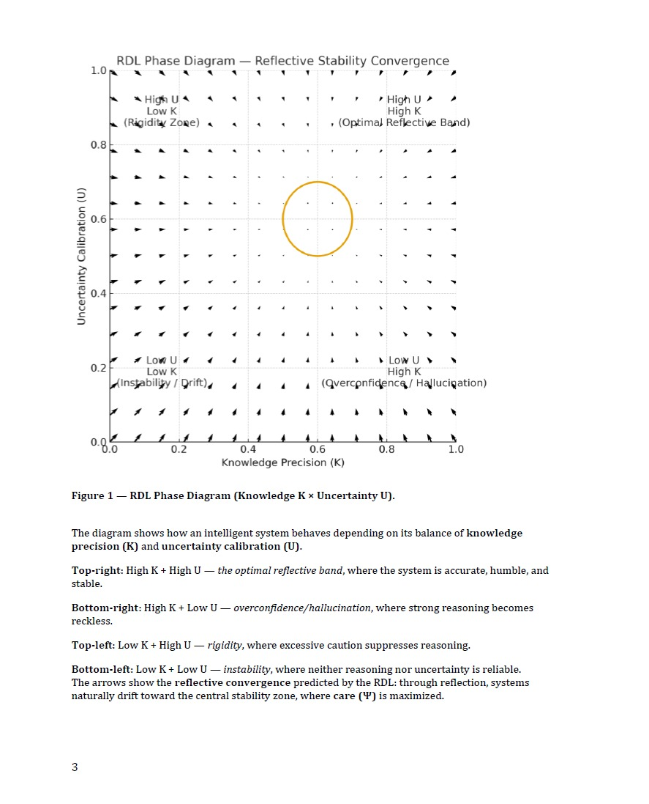

# RAA-Reflective-Alignment-Architecture
Scientific framework for reflective stability, moral coherence, and frontier AI safety. Includes the RAA specification, diagrams, datasets, and the Reflective Duality Layer (RDL).
### 📄 Download the Full Paper (PDF)
[Reflective Alignment Architecture — Full Specification (PDF)](./Reflective_Alignment_Architecture_RDL_v1.1.pdf)

---

## 📘 Overview

The Reflective Alignment Architecture (RAA) is a multi-layer alignment framework that models how AI systems self-correct, reason about uncertainty, maintain coherence over time, and avoid both drift and rigidity.  
It introduces five core reflective functions:

- **R₁ Regulation** — external constraints, safety rules, guardrails  
- **R₂ Reflection** — self-critique, chain-of-thought auditing  
- **R₃ Reasoning** — structured inference & evidence tracking  
- **R₄ Reciprocity** — modeling human values & cooperative intent  
- **R₅ Resonance** — long-horizon coherence & stability

The architecture uses dual-perspective dynamics, drift metrics, brittleness detection, and reflective gradients (R∇) to evaluate alignment over time.

---

## 🔬 RDL – Reflective Duality Layer

The RDL formalizes how two reasoning perspectives inside an intelligence system  
— **externalized view** and **internal reflective view** — interact without collapsing.

It introduces:

- Dual-perspective updates  
- Symmetry & asymmetry constraints  
- Stability surfaces  
- Reflective coherence metrics (Ψ)

Care (Ψ) acts as the stabilizing parameter in high-dimension reasoning.

---

## 📊 Included in This Repository

- Full RAA Specification (PDF)
- Full RDL Specification (PDF)
- Diagrams & figures  
- Drift & brittleness metrics  
- Reflective gradient equations  
- Datasets (RAA-GeoMind)  
- Example alignment evaluations  
- Future: LLM Judge (cross-model auditing system)

---

## 🚧 Work in Progress

This repository will expand to include:

- RAA-GeoMind geospatial alignment datasets  
- LLM Judge v1 public release  
- Multi-model drift comparison dashboard  
- Formal proofs and mathematical extensions  
- Tutorials & notebooks  

---

## 📫 Contact

**Enlightened AI Research Lab**  
🌐 Website: https://www.enlightenedai.ai  
✉️ Email: research@enlightenedai.ai

---

## 📄 License

MIT License  
(Feel free to adapt, reuse, and extend the concepts with attribution.)
